 

  

  <h1 align="center">Thawani For WooCommerce</h1>

  

    Enables Credit/Debit card payments through Thawani on your WooCommerce shop.
     
     
    <a href="https://github.com/PhazeRoOman/thawani-for-woocommerce/issues">Report a bug</a>
  

  

  <a href="https://github.com/PhazeRoOman/thawani-for-woocommerce/releases/latest/download/thawani-for-woocommerce.zip">Download latest release</a>

 

>  
>
> **⚠ INFORMATION & REQUIREMENTS**
>
> - Thawani For WooCommerce is currently only available in Oman.
> - Only OMR is currently supported.
>      

 

The Thawani Plugin for WooCommerce allows merchants to accept Credit & Debit card transactions.

This plugin will only work with WooCommerce and is built to extend it.

## Motivation

The need for this project came from the shortage in the Omani market when it comes to payment gateways that allows online transactions to be in OMR. Most payment gateways do not support this and require some kind of currency conversion as part of the transaction process.

[Thawani Pay](https://thawani.om/about/) is a Payment Gateway that solves this problem. The [Thawani Checkout](https://thawani.om/checkout/) API, allows for transactions to be made using OMR.

This project makes Thawani's API accessible to the public. Making it easy for anyone to setup Credit & Debit Payment on their online store.

## Contribution

The Thawani for Woocommerce plugin is a community project launched by [PhazeRo](https://phaze.ro/) where we would like to give everyone the opportunity to take part in its development. If you wish to contribute and be part of this project look at the [Contribution](./CONTRIBUTING.md) file.

## Features

- Credit & Debit card payment.
- Payments are in OMR no conversion currency needed.
- Easy to switch from sandbox and live environment.
- Checks for payment confirmation.
- Track Session History
- Logging to make debugging easy.
- Sharable payment link

## Requirements

- WooCommerce 5.6+

For live account, please create a [merchant account](https://thawani.om/merchants/) with Thawani then follow the instructions on their [documentation](https://developer.thawani.om/).

## Installation

1. **Download** the .zip file from this repository.

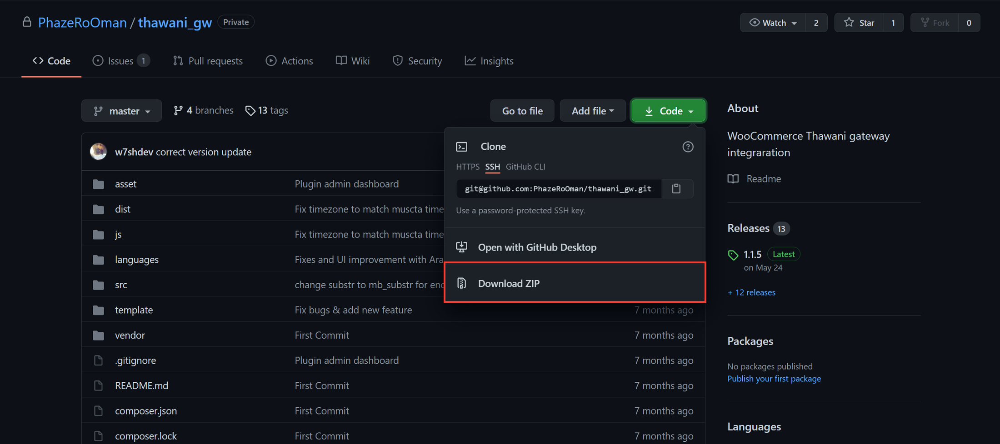

2. **Go to: WordPress Admin > Plugins > Add New** to upload the .zip file you downloaded with Choose File.

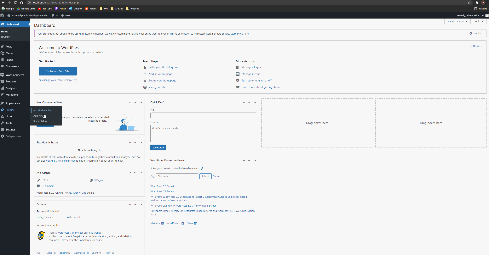

3. **Activate** the extension. (If you haven't already in the previous step)

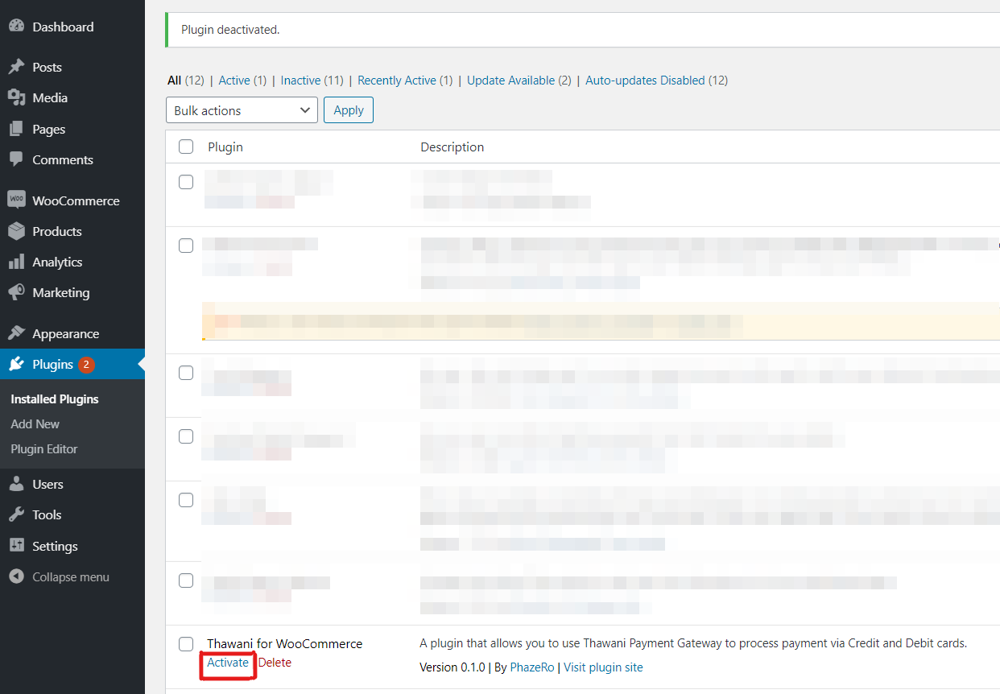

More information at: [Managing Plugins](https://wordpress.org/support/article/managing-plugins/).

For the plugin to work properly, please make sure that your permalink settings are set to _post name_. To do that **Go to: Settings > Permalinks > Common Settings** and make sure that _post name_ is selected.

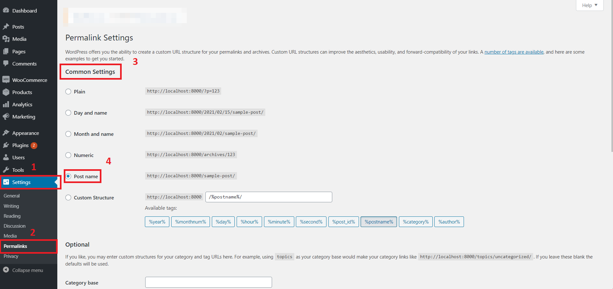

## Thawani For WooCommerce Set up

1. **Go to: WooCommerce > Settings > Payments**.

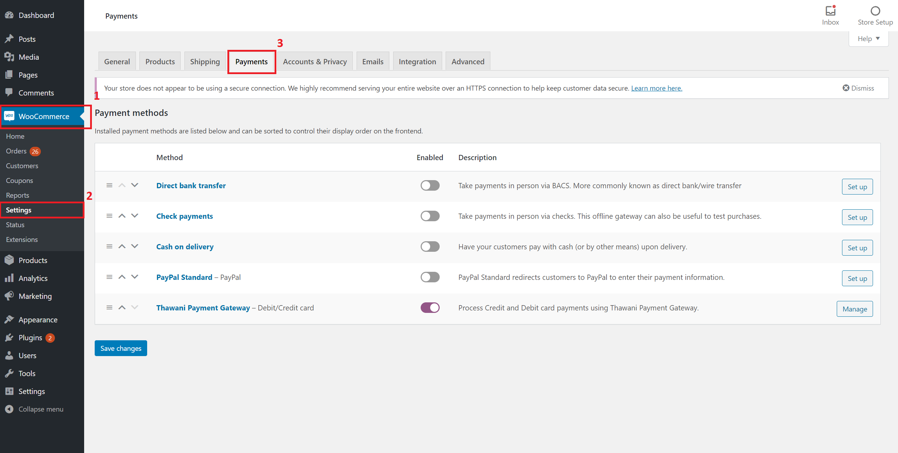

2. Select **Thawani Gateway**. You are taken to the configuration screen.

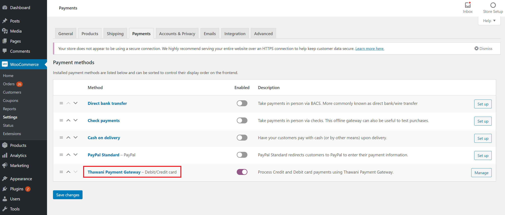

3. **Enable/Disable** – Enabled by default. Disable to turn off Thawani Pay.

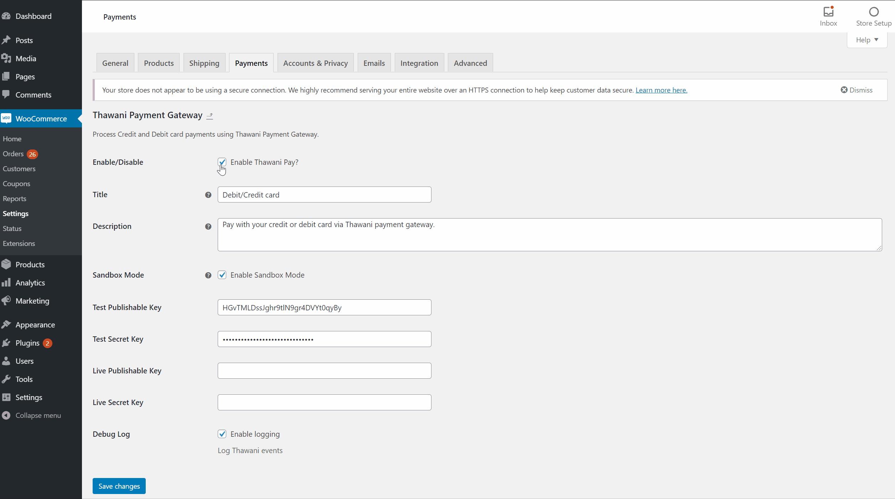

## Configuration

1. Select the Environment:

- Development Environment

In development environment you will be able to make mock payments to simulate the payment processing flow of a live account.

When you are in development mode you will need to use the User Acceptable Test ("UAT") secret and publishable keys and **not** your own secret and publishable keys. These two keys can be found on the [Thawani documentation](https://developer.thawani.om/).

- Production Environment

Production environment is to be used when the website is live

To setup a live account you need the following:

- An SSL certificate.
- A Thawani merchant account. You can apply by visiting [Thawani's website](https://thawani.om/merchants/).
- Access to the Thawani merchant dashboard. This is where you can get your live secret and publishable keys. Learn more by reading [Thawani's documentation](https://developer.thawani.om/).
- Add the following URL: `https//<YOUR-SITE-URL>/wc-api/thawani-payment-status` to the webhook URL section on the Thawani dashboard. Learn more by reading [Thawani's documentation](https://developer.thawani.om/).
- Set the secret and publishable keys in the payment settings page to the secret and publishable keys provided by Thawani

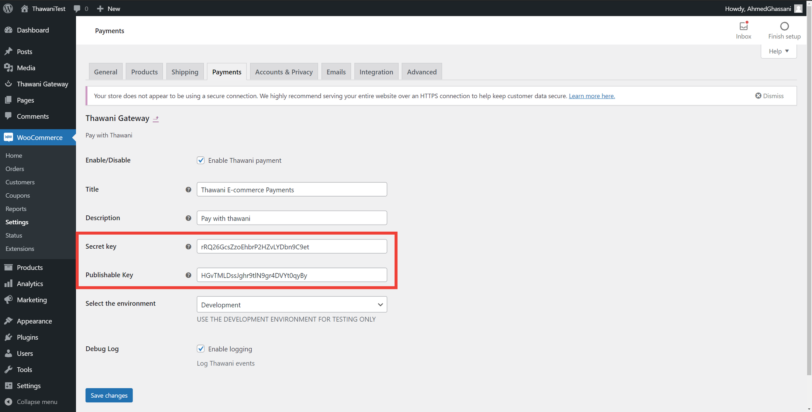

2. Enable logging

Thawani For WooCommerce comes with a troubleshooting tool. This is in the form of logs. The logs are added each time a user orders an item, even if the payment fails.

To enable logging make sure that the _Enable Logging_ checkbox is checked.

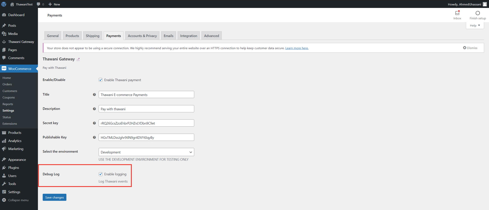

To view the logs **Go to: WooCommerce > Status > Logs**

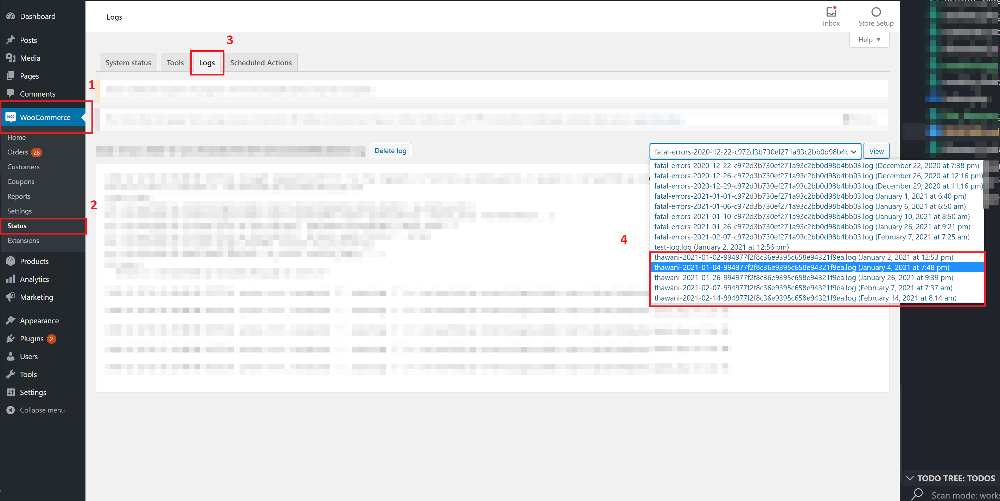

The logs messages for this plugin follow the following format `thawani-<DATE-OF-ORDER-PLACEMENT>`.

## View Session History

The Thawani Gateway plugin keeps a record of all the sessions created to process payments and displays them for the admin.

The plugin keeps a record of:

- Timestamp of when the session was created
- Client refrence / Order ID
- Customer Information
- Payment Status
- Total Amount

To access the session history:
**Go to: WordPress Admin > Thawani Gateway**

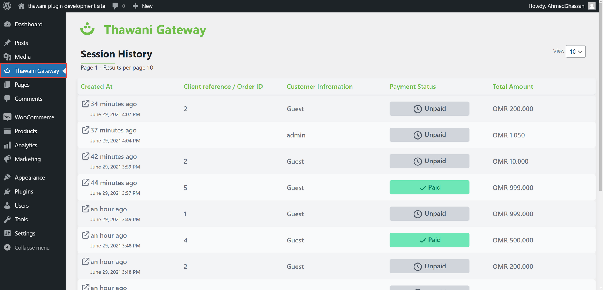

## Customer Checkout Flow

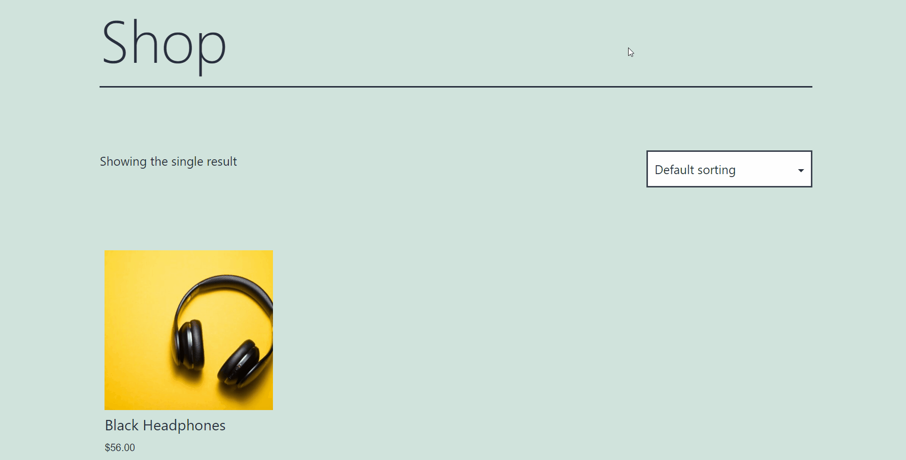

Nothing will be change from WooCommerce's default customer checkout flow. Customers will see an option on their checkout page to select payment via Thawani as shown in the image below:

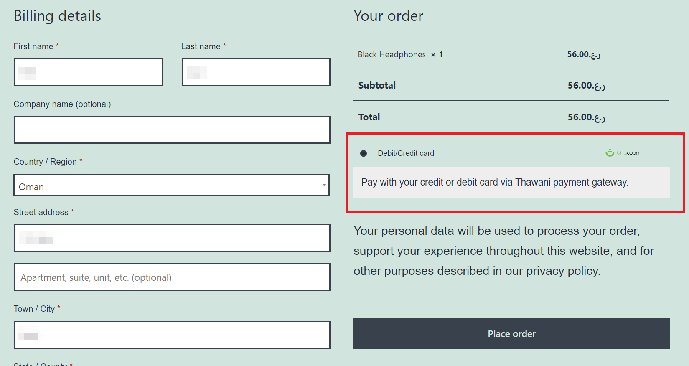

## Admin Order Fulfillment Flow

To view all orders **Go to: WooCommerce > Orders**

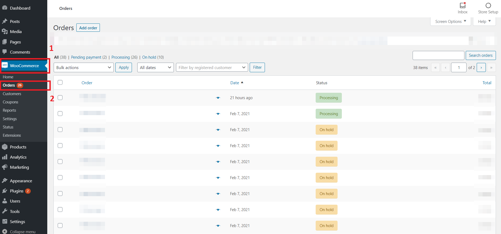

Note that this plugin automatically updates the order status as follows:

- **Processing:** Payment received (paid); order is awaiting fulfillment from merchant.
- **On hold:** Awaiting payment
- **Failed:** Payment failed or was declined (unpaid)
- **Canceled:** Canceled by an admin or the customer

For more information about WooCommerce Orders, Go to: [Managing Orders](https://docs.woocommerce.com/document/managing-orders/).

## Frequently Asked Questions

We welcome input from the community please let us know how we can improve this plugin. Do not hesitate to ask us questions on the [issues](https://github.com/PhazeRoOman/thawani_gw/issues) page.

## License

Distributed under the MIT License. See [License] (https://github.com/PhazeRoOman/thawani-for-woocommerce/blob/changes/LICENSE.md) for more information.

## Maintained By:

- [PhazeRo](https://phaze.ro/)
